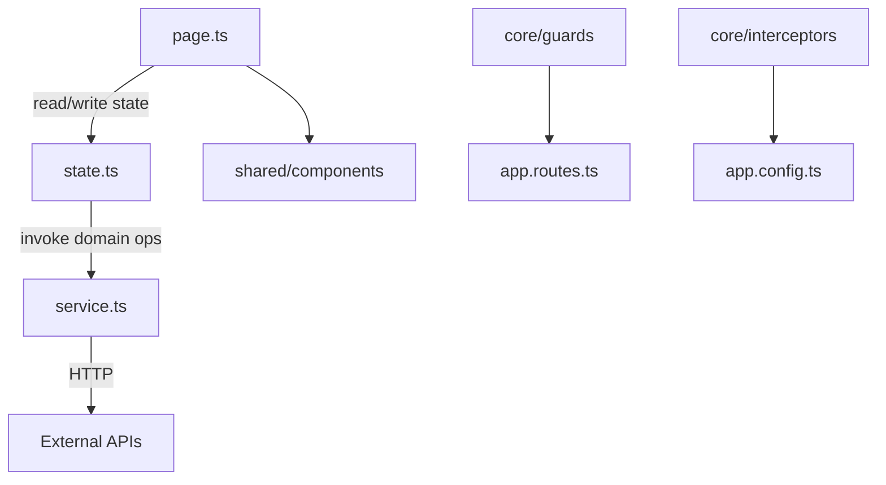

# Skill: Angular Architecture

Use when changing application structure, creating new page domains, or reviewing architectural consistency.

## Objectives

- Keep architecture deterministic and reviewable.
- Enforce standalone-first Angular organization.
- Enforce Signal Store as single state model (global + local). No NgRx.
- Keep one-way dependency flow: page -> state -> service -> http.
- Keep reusable code in `shared`, single-instance infra in `core`, feature logic in `pages`.

## 1) Architectural baseline (mandatory)

- Standalone components by default.
- Root routing file is `src/app/app.routes.ts`.
- Root wiring files:
  - `src/app/app.ts`
  - `src/app/app.config.ts`
  - `src/app/app.routes.ts`
- State model:
  - Signal Store in page domains (`state.ts`) for feature state.
  - Signal Store in `core/states` for global cross-page state.

## 2) Repository layout (`src/`)

```text
src/
  app/
  styles/
    buttons.css
    components.css
    forms.css
    theme.css
    typography.css
    utilities.css
  styles.css
```

Rules:

- `src/styles.css` is global style entrypoint.
- `src/styles.css` imports Tailwind and every file in `src/styles/`.
- CSS is split by concern. Do not collapse all styles into one file.

## 3) App layer architecture (`src/app`)

```text
src/app/
  core/
    guards/
    interceptors/
    services/
    states/
  pages/
    [page-name]/
      [sub-page-name]/          # optional, same structure as parent page
      components/
      constants/
      directives/
      models/
      pipes/
      utils/
      validators/
      page.ts
      service.ts
      state.ts
  shared/
    components/
    constants/
    directives/
    models/
    pipes/
    utils/
    validators/
  app.config.ts
  app.routes.ts
  app.ts
```

### Layer intent

- `core/`: singleton app infrastructure. Instantiate once.
- `pages/`: feature/page domains. Own UI, state, and service boundary.
- `shared/`: reusable cross-feature building blocks with no page-specific coupling.

## 4) Dependency and communication flow

Mandatory data/control flow:

1. `page.ts` consumes and mutates `state.ts`.
2. `state.ts` orchestrates feature logic and calls `service.ts`.
3. `service.ts` owns HTTP calls and transport mapping.
4. Child/presentational components receive state and callbacks via inputs/outputs/signals. They do not call HTTP directly.



## 5) Naming and placement rules

- One page domain = one folder in `pages/[page-name]/`.
- Main page component file is always `page.ts`.
- Main feature service file is always `service.ts`.
- Main feature state file is always `state.ts`.
- New feature-specific model/validator/util stays inside its page folder.
- Move code to `shared/` only after confirmed reuse across multiple pages.
- Keep `core/services` for app-wide infrastructure services, not page business services.

## 6) Mandatory rules and anti-patterns

Do:

- Keep template expressions simple and side-effect free.
- Keep business rules in state/service, not view.
- Keep global state in `core/states` Signal Stores.
- Keep feature state in page-local `state.ts` Signal Stores.

Do not:

- Put business logic in templates.
- Trigger HTTP in components (`page.ts` or child components).
- Duplicate same state in multiple sibling components.
- Leave unmanaged manual `subscribe()` in components.
- Add NgRx artifacts (`actions`, `reducers`, `effects`, `selectors`).

## 7) Architecture review checklist

Before merge, confirm:

- [ ] `src/` layout follows adapter contract (`app`, `styles`, `styles.css`)
- [ ] `src/styles.css` imports Tailwind and all split CSS concern files
- [ ] page domains contain `page.ts`, `service.ts`, `state.ts`
- [ ] dependency flow is `page -> state -> service -> http`
- [ ] no direct HTTP calls in components
- [ ] Signal Store is used for both global and local state
- [ ] no NgRx files/patterns introduced
- [ ] reusable artifacts promoted to `shared` only when actually cross-page

## 8) Migration guidance (when refactoring legacy code)

- Move HTTP logic out of components into `service.ts`.
- Move ad-hoc component state into `state.ts` Signal Store.
- Extract global mutable state into `core/states`.
- Split oversized page folders into `components`, `models`, `utils`, `validators`.
- Keep refactor incremental by page domain to reduce blast radius.

## I/O Reference

|                |                                                                                            |
| -------------- | ------------------------------------------------------------------------------------------ |
| Trigger        | New app scaffold, architecture refactor, feature folder design, state boundary cleanup     |
| Reads          | `src/` tree, `src/app/` boundaries, `app.config.ts`, `app.routes.ts`, `styles.css` imports |
| Invoked by     | `devflow.plan`, `devflow.implement`, `devflow.beautify`                                    |
| Related skills | `angular-component`, `angular-forms`, `angular-http`, `angular-state`                      |
