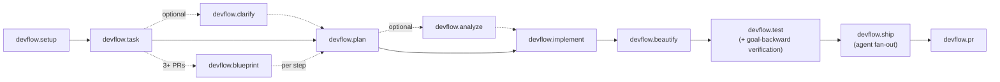

# DevFlow Architecture

How the plugin is put together and why. Companion to [`docs/comparison.md`](comparison.md) (positioning vs alternatives) and [`templates/devflow/README.md`](../templates/devflow/README.md) (component inventory).

## Design constraints

Three constraints shape everything below:

1. **Markdown + bash/jq only.** No runtime engine, no Node dependency. Skills are prompts an agent follows; hooks are POSIX-ish shell scripts. This keeps the plugin portable across hosts (Claude Code, Cursor, Antigravity) and auditable at a glance.
2. **User-gated by default.** Each pipeline step is a command the user invokes. Skills verify their own input contract and refuse to run on bad state; they do not invoke each other (the one exception: `devflow.ship` routes to `devflow.pr` on gate pass).
3. **Adapters own stack truth.** Core skills are stack-agnostic; every stack-specific rule (commands, file layout, technology skills) lives in `adapters/<stack>/ADAPTER.md`.

## Pipeline



Cross-cutting entry points, outside the happy path:

| Command | When |
| --- | --- |
| `devflow.resume` | Session interrupted (restart, compaction, break) — re-enters correct step |
| `devflow.recovery` | State corrupted or step stuck — diagnoses, proposes repair |
| `devflow.backprop` | Bug escaped the pipeline — traces it to the acceptance criterion, tightens the spec, adds a regression test |
| `devflow.status` | Read-only snapshot |
| `devflow.learn` | Persistent project instincts (log/search/prune) |

## Artifacts and state model

Every feature lives in `devflow/features/NNN_name/`:

| Artifact | Written by | Contains |
| --- | --- | --- |
| `task.md` | task/clarify | HMW framing, scope, subtasks, acceptance criteria |
| `plan.md` | plan (then updated by every step) | Architecture decisions, **Traceability table** (subtask → AC → files), ordered File List with `[done]`/`[pending]` markers, `**Status:**` |
| `data-model.md` | plan (conditional) | Technology-agnostic entity definitions |
| `verification.md` | test Step 6b | Per-AC verdict table (existence / substantive / wired / runtime) |

**`plan.md` is the authoritative state.** `.devflow-state.json` at the consumer root is a derived cache written by hooks and by skills at step boundaries. Statuses and legal transitions are defined once in [`references/state-machine.md`](../templates/devflow/references/state-machine.md):

```text
task.md: draft → clarified → done
plan.md: ready → implementing → implemented → beautified → tested → shipped → pr-opened
         any active status → blocked (escalation ladder) → recovery
```

Failure handling is a single bounded ladder ([`references/escalation-ladder.md`](../templates/devflow/references/escalation-ladder.md)): 3 retries → debug mode (max 2 hypotheses) → re-approach the plan → decompose the slice → block with a structured stuck-report.

## Quality gates

Forward-looking and goal-backward checks are deliberately separate:

- **beautify** — multi-axis review of what was written (correctness, readability, security, performance, architecture, UI, a11y).
- **test** — adapter unit/integration targets, plus **goal-backward verification** ([`references/verification-levels.md`](../templates/devflow/references/verification-levels.md)): start from each acceptance criterion, locate its files via the Traceability table, prove it exists, is real code (not a stub), is wired into the app, and — where the adapter defines runtime targets — behaves end-to-end.
- **ship** — parallel specialist agents (code review incl. scope fidelity, security, test coverage) synthesized into a gate report; Critical findings block.

## Hook map

Hooks are automation the agent doesn't have to remember. All in `templates/devflow/hooks/`, registered in `hooks.json`:

| Event | Hook | Role |
| --- | --- | --- |
| SessionStart | `session-start.sh` | Inject discovery skill + active-step context hint |
| SessionStart | `session-start-learnings.sh` | Inject past learnings |
| PreToolUse | `pre-config-protect.sh` | Block linter/analyzer config edits |
| PreToolUse / PostToolUse | `observe.sh` | Tool-call log (`.devflow-observe.jsonl`) |
| PostToolUse | `post-edit-accumulate.sh` | Track modified files for batch checks |
| PostToolUse | `post-task-create.sh` | Maintain feature-number counter |
| PreCompact | `pre-compact.sh` | Snapshot plan progress → `.devflow-state.json` + resume reminder |
| Stop | `stop-format-typecheck.sh` · `stop-debug-check.sh` · `stop-notify.sh` · `stop-learn-distill.sh` | Format/analyze, debug-print scan, notification, churn-based learning distillation |

## Adapter contract

An adapter is a directory under `adapters/<name>/`:

- `ADAPTER.md` — the contract: technology-skills table (path-pattern triggers), MCP baseline, per-step sections (Plan / Implement / Beautify / Test / PR) with exact commands and pre-handoff checklists.
- `skills/<adapter>-<domain>/SKILL.md` — technology skills, loaded on demand when touched file paths match their triggers (never preemptively).
- `templates/` — setup templates (`AGENTS.md`, `REGISTRY.md`, `docs/product.md`).

Core skills read `devflow/config.md` → resolve the active adapter → follow its sections. Adding a stack = adding a directory; core skills don't change.

## Repo layout and build

```text
templates/devflow/   ← source of truth (edit here)
dist/devflow/        ← build output, committed (install this)
scripts/build-plugin.sh  ← manifest-driven build for Claude Code / Cursor / Antigravity
```

Quality tooling on the plugin itself:

| Check | Command |
| --- | --- |
| Structural lint (frontmatter, sections, style) | `bash templates/devflow/scripts/validate-skills.sh --strict` |
| Trigger routing + description collisions (Tier-2 evals) | `bash templates/devflow/scripts/run-evals.sh` |
| Hook syntax | `bash -n templates/devflow/hooks/<script>.sh` |
| Rebuild | `bash scripts/build-plugin.sh` |
